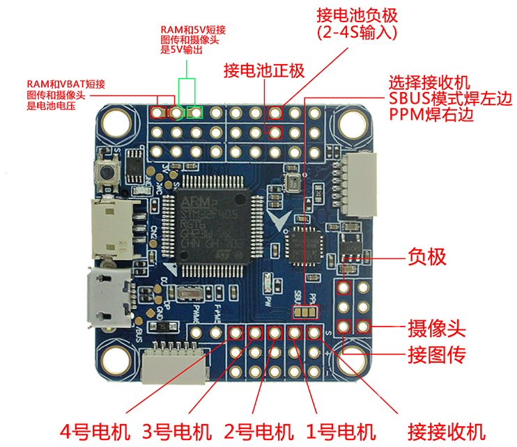
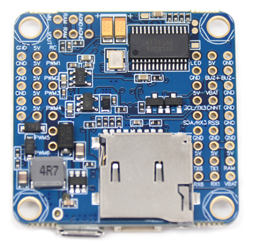

# F4V3飞控

### 使用说明

1.  PCB打样（四层板），可在捷配0元免费打样（绿色）；
2.  按照BOM、PCB工程、原理图焊接元件；
3.  使用Betaflight-configuration软件烧录固件，见[教程](https://www.cnblogs.com/cai-zi/p/14382913.html)，刷写betaflight_3.5.7_OMNIBUSF4SD.hex固件。

### BOM

| 名称                                   | 编号                                                         | 封装          | 数量 | 链接                                                     | 备注               |
| -------------------------------------- | ------------------------------------------------------------ | ------------- | ---- | -------------------------------------------------------- | ------------------ |
| 0.1uf 10%                              | C1, C3, C4, C7, C9, C10, C11,  C12, C14, C15, C18, C20, C24, C28, C29, C30 | 0402          | 16   | [元件](https://item.taobao.com/item.htm?id=523808399191) |                    |
| 贴片钽电容 476J(6.3V 47UF) A型         | C19, C22                                                     | 1206          | 2    | [元件](https://item.taobao.com/item.htm?id=621225828687) |                    |
| 10UF 10%                               | C2, R8                                                       | 0402          | 2    | [元件](https://item.taobao.com/item.htm?id=523808259470) |                    |
| 10NF  10%                              | C26                                                          | 0603A         | 1    | [元件](https://item.taobao.com/item.htm?id=522577056534) |                    |
| 2.2NF 10%                              | C5, C6                                                       | 0402          | 2    | [元件](https://item.taobao.com/item.htm?id=619013976539) |                    |
| 4.7UF  10%                             | C8, C13,  C17, C21, C25, C27, C31                            | 0603A         | 7    | [元件](https://item.taobao.com/item.htm?id=537668686643) |                    |
| 贴片卧式插座  ZH1.5MM 3P 弯针          | CON1                                                         | SMD-5         | 1    | [元件](https://item.taobao.com/item.htm?id=565717809381) |                    |
| 蓝色LED                                | D1                                                           | SOD-323  0603 | 1    | [元件](https://item.taobao.com/item.htm?id=522573257623) |                    |
| 绿色LED                                | D3                                                           | SOD-323 0603  | 1    | [元件](https://item.taobao.com/item.htm?id=522573309525) |                    |
| 1N5819/SL                              | D4, D6,  D7                                                  | SOD-323A      | 3    | [元件](https://item.taobao.com/item.htm?id=522574162326) | 肖特基二极管       |
| B230A                                  | D5                                                           | DO-214        | 1    | [元件](https://item.taobao.com/item.htm?id=617920481376) | 肖特基二极管       |
| MPU-6000                               | IC1                                                          | QUAD24        | 1    | [元件](https://item.taobao.com/item.htm?id=558660111859) | 姿态传感器         |
| AT7456E                                | IC2                                                          | SOP-28        | 1    | [元件](https://item.taobao.com/item.htm?id=625042817979) | 字符叠加，OSD功能  |
| 贴片卧式插座 SH1.0MM 6P 弯针           | J1, J2                                                       | SMD-6         | 2    | [元件](https://item.taobao.com/item.htm?id=565715285795) |                    |
| TF卡座 micro SD卡座                    | J3                                                           | SMD-9         | 1    | [元件](https://item.taobao.com/item.htm?id=522573245737) | 装SD卡，黑匣子功能 |
| MP2359DJ-LF-Z                          | L1                                                           | SOT23-6       | 1    | [元件](https://item.taobao.com/item.htm?id=522554875563) |                    |
| 贴片一体成型大电流功率电感  0520-4.7UH | L2                                                           | SMD-2         | 1    | [元件](https://item.taobao.com/item.htm?id=618574718272) |                    |
| 2N3904/1AM                             | Q1, Q2                                                       | SOT-23        | 2    | [元件](https://item.taobao.com/item.htm?id=623279696464) | 可用SS8050代替     |
| 10K 5%                                 | R1, R2, R3, R4, R7, R9, R10,  R12, R13, R19, R20, R21, R23, R24, R25, R26, R29, R33 | 0402          | 18   | [元件](https://item.taobao.com/item.htm?id=525633713781) |                    |
| 22R  5%                                | R11, R15                                                     | 0402          | 2    | [元件](https://item.taobao.com/item.htm?id=525596482937) |                    |
| 1K 5%                                  | R16, R17, R18, R27                                           | 0402          | 4    | [元件](https://item.taobao.com/item.htm?id=525568795296) |                    |
| 100R  5%                               | R22                                                          | 0402          | 1    | [元件](https://item.taobao.com/item.htm?id=525601033663) |                    |
| 100K 5%                                | R28                                                          | 0402          | 1    | [元件](https://item.taobao.com/item.htm?id=525633701805) |                    |
| 75R  5%                                | R30, R31                                                     | 0402          | 2    | [元件](https://item.taobao.com/item.htm?id=525561903747) |                    |
| 56K 5%                                 | R32                                                          | 0402          | 1    | [元件](https://item.taobao.com/item.htm?id=525633973398) |                    |
| 10K  1%                                | R5                                                           | 0603          | 1    | [元件](https://item.taobao.com/item.htm?id=525777943950) |                    |
| 330R 5%                                | R6, R14                                                      | 0402          | 2    | [元件](https://item.taobao.com/item.htm?id=525603730115) |                    |
| 贴片按键开关 3*3*1.5MM 轻触开关 4脚    | S1                                                           | SMD-4         | 1    | [元件](https://item.taobao.com/item.htm?id=546724337380) |                    |
| SN74LVC2G86DCUR                        | U1                                                           | SO-8          | 1    | [元件](https://item.taobao.com/item.htm?id=565719170890) | 逻辑门             |
| SPX5205M5-L-3-3                        | U2, U3,  U4                                                  | SOT23-5       | 3    | [元件](https://item.taobao.com/item.htm?id=522573685822) | 3.3V降压           |
| PL06-001 PL06 无人机 气压传感器        | U6                                                           | SMD-6A        | 1    | [元件](https://item.taobao.com/item.htm?id=536588151627) | 可用BMP280代替     |
| STM32F405RGT6                          | U7                                                           | QUAD64        | 1    | [元件](https://item.taobao.com/item.htm?id=522577756409) | 主控               |
| 贴片MicroUSB插座 5P 5针 四脚插板插座   | USB1                                                         | SMD-5A        | 1    | [元件](https://item.taobao.com/item.htm?id=538147501606) |                    |
| 贴片晶振8MHz 3脚3213                   | Y2                                                           | SMD-3A        | 1    | [元件](https://item.taobao.com/item.htm?id=620069296989) | CSTCE8M00G52-R0    |
| 贴片晶振 27MHZ  3225                   | Y3                                                           | SMD-4A        | 1    | [元件](https://item.taobao.com/item.htm?id=613138100245) |                    |